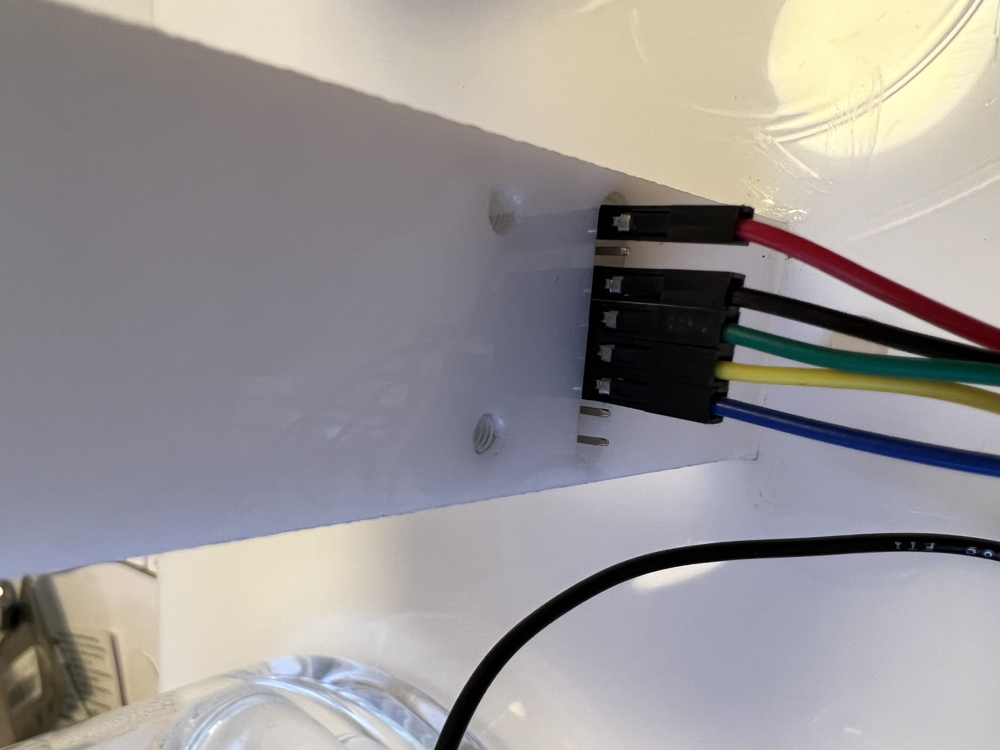

# An Ecological Oracle - Installation Guide
Below are the instructions for the time-based experiment, _An Ecological Oracle_. The piece can be reset daily once the gallery opens.
## Hardware
### Water Setup
First, ensure there is 600 ml of water in the beaker that does not have a nested tipping point beaker within it. Place that beaker on the left side of the motor (facing the black cap).

Next, ensure that the smaller beaker is filled to the brim. Squeeze ample red dye in this beaker.

### Wiring
Everything should be shipped plugged in. In the case that it is not, follow the photos below. When in doubt, similar colored wires will go together with similar colored wires.

The tipping point sensor wire will be fed into pin 7 in the Arduino.

The two wires the control the read from the AQI sensor will be fed into A5 and A4. Those wires are yellow and green respectively.

The motor should be secured in the motor shield. In the case it is not, it should be screwed into + and - in one of the terminals.



### ESP 32
This microcontroller will count bluetooth and wifi data. It should be plug-and-play with a USB port.

### Power
The installation requires both USB power from a Mac Mini or equivalent as well as the 12v power supply attached to the wired barrel jack. The latter is for pump control.

### Other Hardware
The motor mount will likely need a little bit of silicon to secure its placement in the box.

The silicon tubing needs to sit flush against the bottom of each beaker.

The hardware should fit under the white box.

## Software

### Overall notes
The installation operates using a local node.js app. _This app is best run on Google Chrome._

### Node installation
The app should be able to run with the latest version of node. Download the repository, open up Terminal and navigate to the directory. From there, type:
```
  npm install
```

Once the app is installed type:
```
  npm start
```

If there are errors with the serial connections, Terminal will likely yell at you here. You'll need to change the names of ports in the app.js file.

If all goes smoothly, open up a new Chrome window and type:
```
  http://localhost:3000
```

Everything should be running now. You'll see console.log statements in the terminal which will tell you about motor speed.

### Calibrating
In client.js at the top of the file, we'll want to calibrate all of the settings. These are all held in the following blocks:
```
  /**
    This is the most important block!
    Adjust thresholds and weights below:
  */

  const URBANIZATION_THRESHOLD = 4;
  const VOLUME_THRESHOLD = 4;
  const CO2_THRESHOLD = 400;
  const TVOC_THRESHOLD = 2;

  // WEIGHTS
  const URBANIZATION_WEIGHT = 6;
  const VOLUME_WEIGHT = 2;
  const CO2_WEIGHT = 5;
  const TVOC_WEIGHT = 5;
```

When the tipping point strikes, the front end will let you know the time elapsed. We can use that as a gauge to determine how to go about adjusting the weights/calibrated states daily.
